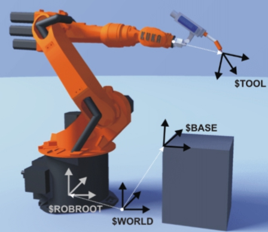
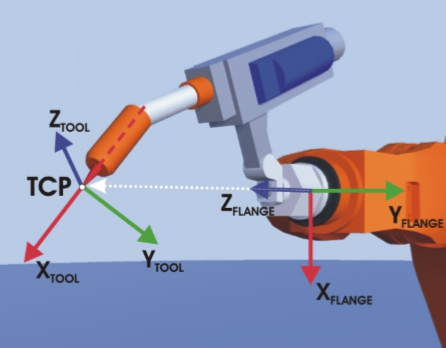
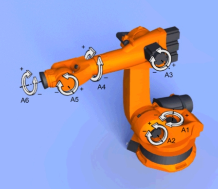
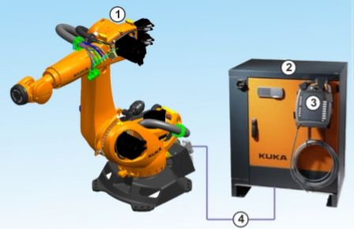
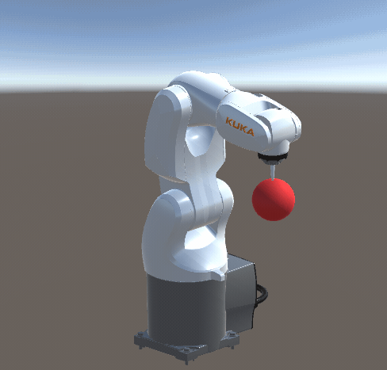
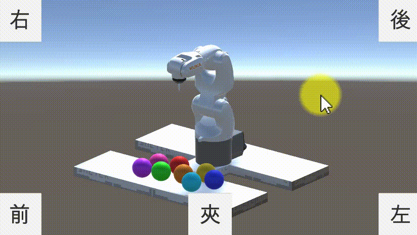
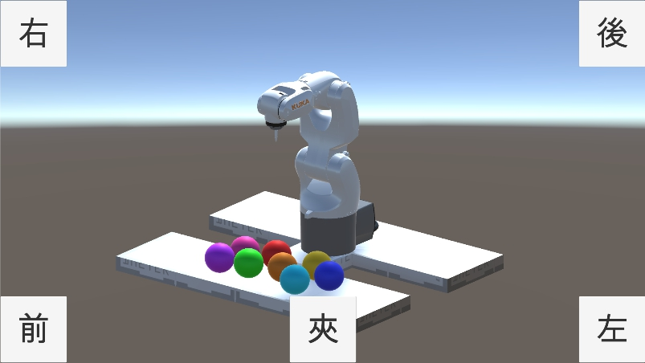
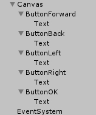

# 卓智創意互動科技
* 官網：[http://www.wtech.com.tw/](http://www.wtech.com.tw/)
* Facebook：[https://www.facebook.com/wisetech.dakuo/](https://www.facebook.com/wisetech.dakuo/) 


## 業界在互動應用中的工具
1. Unity [wiki](https://zh.wikipedia.org/wiki/Unity_(%E6%B8%B8%E6%88%8F%E5%BC%95%E6%93%8E))
1. Maya [wiki](https://zh.wikipedia.org/wiki/Maya)
1. 3dMax [wiki](https://zh.wikipedia.org/wiki/3ds_Max)


## Unity應用案例(廣告時間)
* 例：[愛之味體感互動遊戲](https://www.facebook.com/wisetech.dakuo/videos/885588164860007/)
* 例：[互動射擊裝置](https://www.facebook.com/wisetech.dakuo/videos/664104040341755/)


## Unity+leapmotion與機器手臂
* [連結1](https://www.facebook.com/wisetech.dakuo/videos/1212236958861791/)
* [連結2](https://www.facebook.com/wisetech.dakuo/videos/1225804447505042/)

> * 這些工具能只能做遊戲、APP或AR/VR嗎?
> * 擔心學了以後無處可用嗎?
> * 這幾週的課程內容會教大家，我們是怎麼把工具當作工具用

解決問題的流程
> 1. 發現問題
> 1. 假設解決辦法
> 1. 使用工具製作出解決辦法
> 1. 使用解決辦法來解決問題


## 例：RobotSim Webplayer

- 發現問題
	- 機器手臂一台幾十到幾百萬，客戶在購買之前對它不了解就降低了購買意願，如果可以先玩玩看再決定買不買呢?

- 假設解決辦法 
	- 不如我們提供手臂讓客戶玩玩看?(公司不會買手臂來只為了讓客戶玩，玩完後決定不買不就浪費錢了)
	- 那模擬一個虛擬的機器手臂讓客戶玩看看?(可能可行，那要來公司玩嗎?還是可以線上玩?)
	> 如果製作一個線上可以模擬機器手臂運作的機器手臂模擬器應該可行?(假設解決辦法)

- 使用工具製作出解決辦法
	- 製作網頁中的手臂模擬器 -> Unity 可以製作完成後輸出成WebGL 在現代的瀏覽器中可以模擬3D畫面 讓客戶模擬手臂運作
	- 機器手臂模型 -> 由機器手臂公司可下載得到 轉檔成可輸入Unity的格式即可

- 使用解決辦法來解決問題
	- 我們把模擬器放到網站上了
	- 網址在這邊 [RobotSim WebPlayer](http://www.wtech.com.tw/robotsim)
	- 歡迎大家來玩~~~ 


## 同學們的遊戲時間
大家邊玩邊我們邊了解一些機器手臂的運作及相關背景知識 

- 在模擬器中我們可以學到這些
	- 座標系
		- WORLD
		- BASE
		- TOOL    
	- 操作方式
		- XYZ ABC
		- AXIS
	- 運動指令
		- PTP
		- LIN
		- CIRC(網頁版的模擬器中沒有) 
	- 軸極限  
		- A1~A6
	- 手臂程式執行方式
		- 先教點
		- 用指令讓手臂重現動作 

## TOOL

 
## A1~A6

    
- 實際上機器手臂的硬體有這幾個部份 
	1. 機器手臂 
	1. 機器手臂控制器 
	1. 機器手臂教導盒 
	1. 連接線



## 探索新世界-RobotSim
想看看在Unity內可以怎麼玩機器手臂嗎?  
Unit還有這種使用方式(之二)?! 只有想不到，沒有做不到。
> 想像力是你的超能力 

- RobotSim 下載-安裝-試用
	- 影片參考 [連結](https://www.youtube.com/watch?v=xv4v_fOwAC0&index=20&list=PLYLTPJkULAAZZuNW2s2tX-KWQOus7sAAo).
- RobotSim-教點-程式-模擬
	- 影片參考 [連結](https://www.youtube.com/watch?v=4Gk7K88B10c&index=21&list=PLYLTPJkULAAZZuNW2s2tX-KWQOus7sAAo).
- RobotSim-設定Tool-更新點位-模擬動作
	- 影片參考 [連結](https://www.youtube.com/watch?v=NLA6A_qWDgs&index=22&list=PLYLTPJkULAAZZuNW2s2tX-KWQOus7sAAo).
- RobotSim-設定Base-設定手臂-匯出程式
	- 影片參考 [連結](https://www.youtube.com/watch?v=izkk5MW-FeY&index=23&list=PLYLTPJkULAAZZuNW2s2tX-KWQOus7sAAo).

## 在RobotSim 中還能做什麼?
- 加入夾爪讓手臂可以取放物件? OK
- 把手臂放在滑軌上讓手臂運作空間更大? 好
- 規劃一條生產線? 可以
- 加入其他品牌的手臂? 當然
- 設計一套自動化流程，產生各種手臂的運動程式? 沒問題

## 你想做什麼?
[歡迎加入RobotSim討論區](http://forum.wtech.com.tw/viewforum.php?f=17&sid=4a42cdd8643e5518dd23f732ca23f0c4).
  


# 加入夾爪Gripper 功能
1. 夾爪程式
1. 手臂指令程式
    - 影片參考 [連結](https://www.youtube.com/watch?v=2DKrwhG3KW8&index=24&list=PLYLTPJkULAAZZuNW2s2tX-KWQOus7sAAo).
1. Test 測試夾爪功能  
    - 影片參考 [連結](https://www.youtube.com/watch?v=1RWDpyVuM2E&index=25&list=PLYLTPJkULAAZZuNW2s2tX-KWQOus7sAAo).
1. 夾爪建構/動畫 Animator
    - 建立夾爪(建模軟體或在Unity內可用ProBuilder)
    - 建立動畫(動畫軟體或在Unity內製作Animator動畫)
    - 於Tool上加入Animator用來播放夾爪動畫(Idle、Lock、UnLock)    
1. Demo 
    > 客人這是你的章魚燒。給你~不給你~再給你~才怪~啦啦啦~  
      


## 夾爪程式 Gripper

```cs
//Gripper.cs
using System.Collections;
using System.Collections.Generic;
using UnityEngine;

public class Gripper : MonoBehaviour
{
	// Gripper程式會有2種模擬夾取
	// 1.利用OnTriggerEnter自動取得在夾取範圍內的物件，夾取指令時將該物件的parent設為Gripper
	// 2.以夾爪播放夾取動畫的方式移動夾爪，並利用Rigidbody產生夾取

	//準備夾取的物件
	public Transform readyGet;
	//目前夾持的物件
	public Transform holdingObject;

	//夾取指令(將readyGet物件Parent設為Gripper)
	public void Lock(Transform product)
	{
		if (holdingObject == null)
		{
			if (product)
			{
				product.transform.parent = transform;
				holdingObject = product;
			}
		}
	}

	//傳回目前所夾持物
	public Transform Unlock()
	{
		Transform returnObject = holdingObject;
		holdingObject = null;//清空目前所持物

		return returnObject;
	}

	//夾取readyGet物件
	public void LockReadyGet()
	{
		Lock(readyGet);
	}
	//放開夾取物件
	public void UnlockToWorld()
	{
		if (holdingObject)
		{
			holdingObject.parent = null;
		}
		holdingObject = null;//把手上拿著的東西丟到世界Root去
	}
	//偵測目前可夾取物
	void OnTriggerEnter(Collider other)
	{
		readyGet = other.transform;
	}
	//移除目前圖夾取物
	void OnTriggerExit(Collider other)
	{
		if (readyGet == other.transform)
		{
			readyGet = null;
		}
	}
}

```

## 手臂指令程式 RobotCommandGripper

```cs
//RobotCommandGripper.cs
using UnityEngine;
using RobotSim;
using System;

public class RobotCommandGripper : RobotCommand
{
	//對應操作的夾爪
	public Gripper gripper;
	//夾爪動畫
	public Animator animatorGripper;
	//夾持命令
	public bool Lock = false;

	//檢查是否有設定好夾爪
	public override bool Check()
	{
		if (gripper)
		{
			errorMassage = "Gripper is NULL";
			return true;
		}
		else
		{
			return false;
		}
	}

	//執行夾爪動作
	public override int Execute()
	{
		if (Lock)
		{
			//夾取(以設定Parent方式)
			gripper.LockReadyGet();
			//夾取(播放動畫)
			if (animatorGripper)
			{
				animatorGripper.speed = 1;
				animatorGripper.Play("Lock", -1, 0);
			}
		}
		else
		{
			//放開(以設定parent方式)
			gripper.UnlockToWorld();
			//放開(播放動畫)
			if (animatorGripper)
			{
				animatorGripper.speed = 1;
				animatorGripper.Play("UnLock", -1, 0);
			}
		}
		//動作完成，執行下一行
		return (line + 1);
	}

	public override string ExportDat()
	{
		//不需要輸出任何程式到Dat檔
		return "";
	}

	public override string ExportSrc()
	{
		//輸出  GripperLock(true/false);  至 手臂程式src檔內
		return tab + "GripperLock(" + Lock.ToString() + ");" + Environment.NewLine;
	}

	public override string UpdateName()
	{
		//更新Gameobject在階層視窗內的名稱
		return (gameObject.name = "GripperLock(" + Lock.ToString() + ")");
	}

}
```

## Test 測試夾爪功能
同學們的遊戲時間

## 模擬手臂指令 RobotCommand 流程講解
- Check()
- Execute()
- UpdateName()
- ExportSrc()
- ExportDat()
 
# 夾娃娃機控制
- UI控制
- 更新手臂動作
- (修改)夾爪控制
- Demo
> 簡單的試夾一下~
> 

## UI控制
- 加入UI


- UI階層




- UI控制手臂程式碼 RobotCommandControlRobot

```cs
//RobotCommandControlRobot.cs
using UnityEngine;
using UnityEngine.UI;
using RobotSim;

public class RobotCommandControlRobot : RobotCommand
{
	public RobotPoint moveTarget; //等待點
	public RobotPoint gripTarget; //夾取點
	public Button ButtonForward;  //UI向前按鈕
	public Button ButtonBack;     //UI向後按鈕
	public Button ButtonLeft;     //UI向左按鈕
	public Button ButtonRight;    //UI向右按鈕
	public Button ButtonOK;       //UI夾取按鈕

	private float moveX = 0;  //按下左或右時移動的距離
	private float moveZ = 0;  //按下前或後時前後移動的距離
	private bool done = false;  //是否已移動完畢(手臂可以繼續動作向下夾取)
	
	public override bool Check()
	{
		if (moveTarget == null)
		{
			errorMassage = "未設定等待點";
			return false;
		}
		if (gripTarget == null)
		{
			errorMassage = "未設定夾取點";
			return false;
		}	
		return true;
	}

	//在Unity環境中每FixedUpdate會呼叫此Execute()一次
	public override int Execute()
	{
		Vector3 updatePosition = moveTarget.transform.position;
		//原本的預備點

		updatePosition.x += moveX;//更新左右位置
		updatePosition.z += moveZ;//更新前後位置
		moveX = 0;
		moveZ = 0;
		
		moveTarget.transform.position = updatePosition;
		//將變更套用至預備點

		updatePosition.y = gripTarget.transform.position.y;
		//更新夾取點的高度值
		
		gripTarget.transform.position = updatePosition;
		//將變更套用至夾取點

		robot.Inverse(moveTarget.transform);
		//手臂動作更新

		//若操作已完成，則讓手臂程式執行下一行程式，否則繼續執行目前這行程式
		if (done)
		{
			done = false;
			return (line + 1);
		}
		else
		{
			return line;
		}
	}
	
	//當選擇匯出程式時會執行此ExportDat()，將回傳的值寫進手臂程式原始src檔中
	public override string ExportDat()
	{
		return "";
	}

	//當選擇匯出程式時會執行此ExportSrc()，將回傳的值寫進手臂程式原始dat檔中
	public override string ExportSrc()
	{
		return "";
	}

	//更新在階層列表上的此物件名稱
	public override string UpdateName()
	{
		return (gameObject.name = "Move(" + moveTarget.name + "," + gripTarget.name + ")");
	}

	//初始化 設定UI按鈕按下時移動數值變更
	void Start()
	{
		ButtonForward.onClick.AddListener(
			delegate
			{
				moveZ = 0.01f;//向前移動1公分
			});
		ButtonBack.onClick.AddListener(
			delegate
			{
				moveZ = -0.01f;//向後移動1公分
			});
		ButtonLeft.onClick.AddListener(
			delegate
			{
				moveX = -0.01f;//向左移動1公分
			});
		ButtonRight.onClick.AddListener(
			delegate
			{
				moveX = 0.01f;//向右移動1公分
			});

		ButtonOK.onClick.AddListener(
			delegate
			{
				done = true;//動作完成，開始夾
			});
	}
	
}
```

## 夾爪控制
修改夾爪控制程式碼，當夾爪張開時，物體向下掉落。

```cs
//Gripper.cs
	//放開夾取物件
	public void UnlockToWorld()
	{
		if (holdingObject)
		{
			holdingObject.parent = null;
			//若物件上有剛體則開啟重力(讓物體隨重力掉落)
			if (holdingObject.GetComponent<Rigidbody>())
			{
				holdingObject.GetComponent<Rigidbody>().useGravity = true;
			}
		}
		holdingObject = null;//把手上拿著的東西丟到世界Root去
	}
```

## 使用物理方式夾取物件
- 夾爪建構/動畫 Animator
  - 建模 Cube夾爪
  - 動畫 
    - 必需要有Idle、Lock、UnLock 三組動畫
    - Idle 當夾爪預設無動作時
    - Lock 夾爪夾取動作
    - UnLoad 夾爪放開動作
- 
<!--stackedit_data:
eyJoaXN0b3J5IjpbMTA5NjkzMzYyMSwtMTM4MjI4Mzg5MCwxMT
cwNjU4NDA5LC04NjMwMjEyOTksLTkxNTgzNTY3OSwxNjE0NDA5
NjY5LDQ4MzcxNzc5OCwyMDA0ODE2MjM3LC0xMzQxMDg3NDAyLD
E3NzIxMjk1NTYsMTIxNjYwNjA2OCwtMTMzNzY1NDM1OCwtMTcw
MjMxODg1MCwzMDMzNjk2OCwyMDc3NDMwNTMzLC0xMTEyNDgxMj
Q3LDE3NDQ1MzAzNiwtNDg4MjI3MDQsLTEwNzcwNzg1NF19
-->